  

  

## 📌 About Me
- Computer Science & Data Science graduate with a deep specialization in Artificial Intelligence and Big Data Engineering. Proficient in designing scalable machine learning pipelines, automating complex workflows, and developing 3D interactive web applications. Expert in Python, Java, and Cloud Infrastructure, with a proven track record of building end-to-end AI solutions from data ingestion to cloud deployment

## 🧠 My Focus Areas
- TECHNICAL SKILLS
- AI & Machine Learning: Deep Learning (PyTorch/TensorFlow), Computer Vision, NLP, Scikit-learn.
- Data Engineering: SQL & NoSQL (PostgreSQL, MongoDB, Firebase), Spark, Data Warehousing, ETL Pipelines.
- Software Development: Python, Java (OOP Expert), R, TypeScript, React 19 (3D UI/UX).
- DevOps & Automation: n8n Expert, Docker, Kubernetes, AWS/Azure Cloud Deployment.
- Operating Systems: Advanced Linux Administration (Shell Scripting, Server Management).
- Tools: Git/GitHub, CI/CD Pipelines, Advanced Excel, Power BI

## 📊 GitHub Stats & Trophies

  
  

  

  

  

## 🛠️ Languages & Tools

> ## Programming Languages

    

> ## Frontend

 

> ## Backend

 

> ## Database

 

> ## DevOps & Cloud

 

> ## Tools

  

  

## 🔗 Connect with Me

   

  

  

